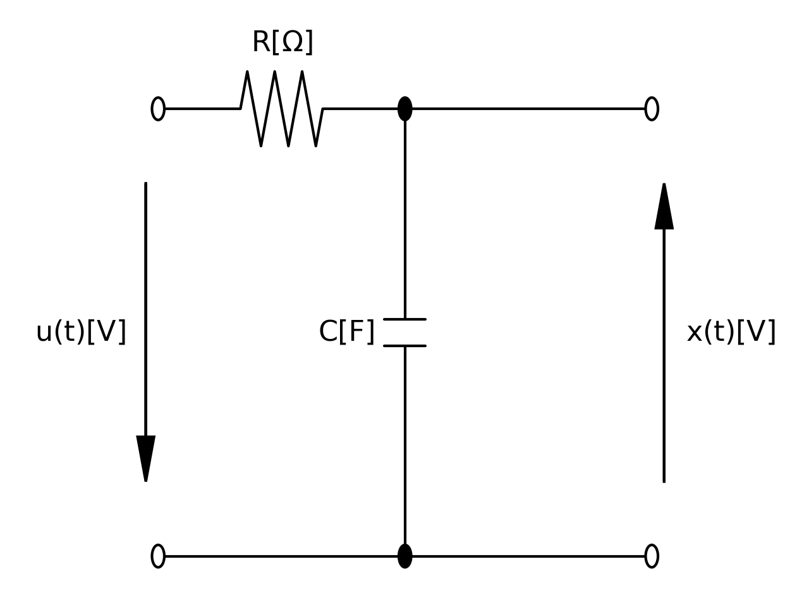
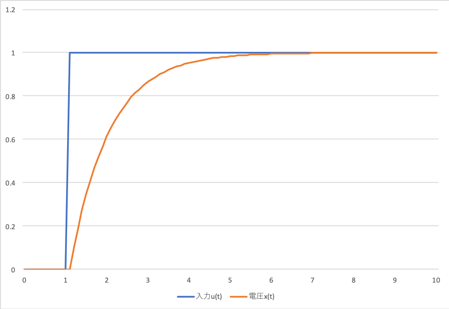
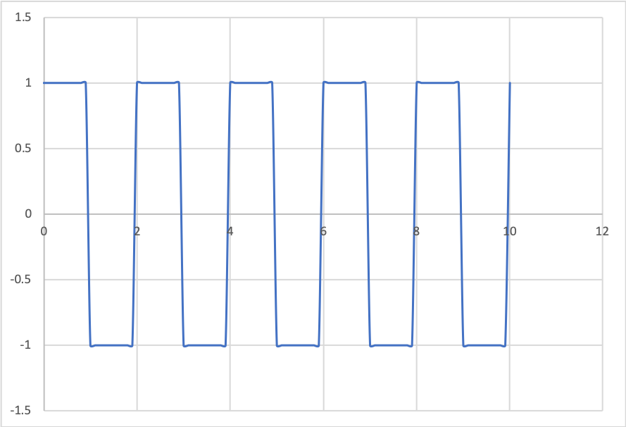
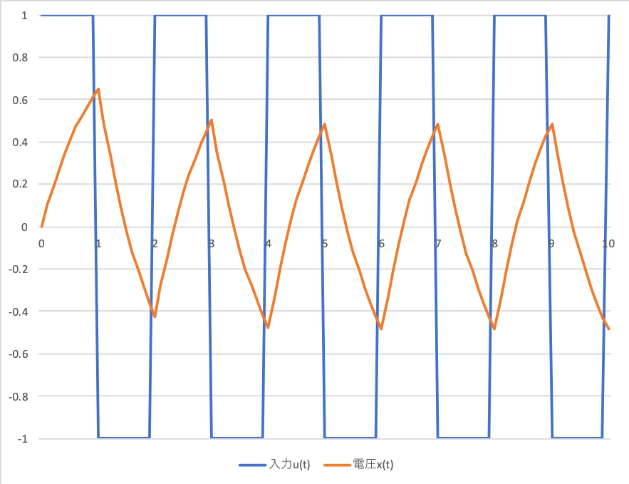

## 実習1
図1のCR回路に入力としてステップ状の電圧が加わった場合の電圧$x(t)と入力u(t)$を図2に示す。

図1. CR回路

図2. 入力$u(t)$と電圧$x(t)$

## 実習2
入力が図3のような周期2[s]、振幅1[V]の矩形波の場合のシミュレーション結果を図4に示す。

図3. ステップ入力

図4. ステップ入力と出力電圧

# 実習3
放射性物質の崩壊の微分方程式は次式となる。セシウム137($半減期30.1年、\lambda=7.3\times10^{-10}$)の場合のシミュレーション結果を図5に示す。ただし、$x_0=1$とする。

$$\frac{dx(t)}{dt} = -\lambda x(t)$$