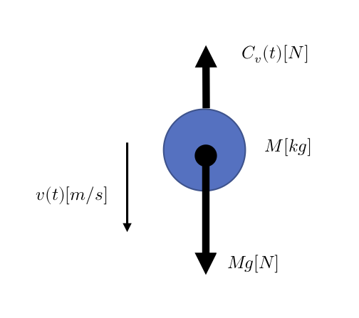
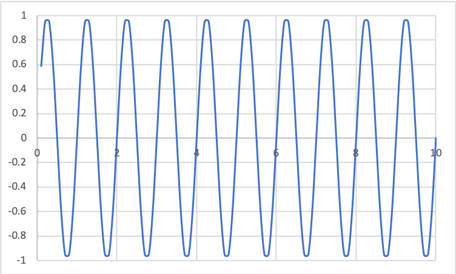
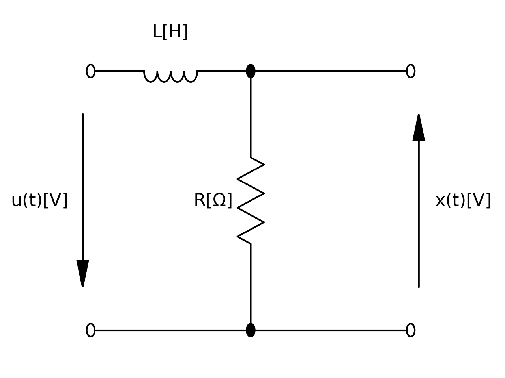

## 実習4-2
図1のような質量 M[kg] の物体の自由落下について考える。
空気中で物体は速度 v(t)[m/s] に比例した空気抵抗 Cv(t)[N] を受けるものとする。
ここで C[Ns/m] は空気抵抗係数である。

  

この物体の運動方程式は次式となる。  

  

微分方程式は次式となる。  

.gif)  

この微分方程式をオイラー法でシミュレーションするプログラムがjisshu4-2.cである。

## 実習4-3
jisshu3-2.cに入力が図2のような周波数1[Hz]、振幅1[V]の正弦波の場合のシミュレーションを行う。

  

## 実習4-4
図3のLR回路に入力として単位ステップ状の電圧を加える場合のシミュレーションプログラムをjisshu4-4.cに示す。
ここで、L = 1[mH], R = 1[kΩ] とする。
  
